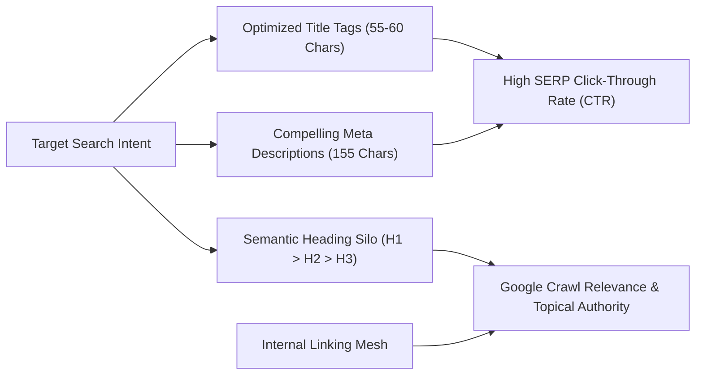

# Adrian Saint Corporate Mentalist
## Monthly Website Development & Technical SEO Performance Report
**Reporting Period:** September 2026  
**Client:** Adrian Saint | Adrian Saint Entertainment  
**Platform:** [https://adriansaintmentalist.com](https://adriansaintmentalist.com)  

---

### Executive Summary

During September 2026, the digital presence for **Adrian Saint – Corporate Mentalist & Mind Reader** underwent a complete structural and search optimization overhaul. The web platform was scaled from an individual showcase into a full-funnel, enterprise-grade corporate lead generation ecosystem consisting of **15 fully optimized production pages**:
- **1 Flagship Homepage** with high-conversion booking architecture.
- **1 Dedicated Fast-Track Contact & EPK Booking Hub**.
- **10 Local SEO Regional Landing Pages** dominating key corporate event markets across Southern California and the Southwest.
- **3 Dedicated Service Landing Pages** spotlighting Adrian’s core performance formats.

Every single page received meticulous **On-Page SEO Optimization** (title tags, meta descriptions, semantic headings, keyword integration, and contextual internal linking), enterprise-grade **Technical SEO & Schema.org JSON-LD**, and high-impact **Conversion Rate Optimization (CRO)**.

---

### 1. On-Page SEO Optimization (Sitewide Implementation)

Every page across the 15-page platform was audited and rebuilt with granular, search-intent-aligned On-Page SEO factors designed to capture high-intent corporate meeting planners and executive event organizers.

#### A. Title Tag Optimization (15 Custom Titles)
All `<title>` tags were crafted to stay within optimal Google desktop and mobile character display boundaries (50–60 characters) while maintaining a strict formula: `[Primary Keyword] + [Geographic Market / Service Type] | [Secondary Modifier] | Adrian Saint`.

*Sample Live Title Tags:*
- **Homepage:** `ADRIAN SAINT | Corporate Mentalist & Mind Reader for High-Impact Events`
- **Corporate Stage Show:** `Corporate Stage Show | Interactive Mentalism & Mind Reading by Adrian Saint`
- **Strolling Mind Reading:** `Strolling Mind Reading | Close-Up Mentalism & Cocktail Reception Entertainment`
- **Team Building:** `Corporate Team Building & Mind-Sync Experiences | Adrian Saint`
- **Contact & EPK Hub:** `Contact & Book Adrian Saint | Corporate Mentalist & Mind Reader`
- **Los Angeles Hub:** `Corporate Magician & Mentalist Los Angeles | Mind Reader for LA Corporate Events & Galas`
- **Anaheim Hub:** `Corporate Magician & Mentalist Anaheim | Mind Reader for Anaheim Events & Conventions`
- **Irvine Hub:** `Corporate Magician & Mentalist Irvine | Mind Reader for Irvine Tech Events & Summits`
- **San Diego Hub:** `Corporate Magician & Mentalist San Diego | Mind Reader for San Diego Conferences & Galas`
- **Scottsdale Hub:** `Corporate Magician & Mentalist Scottsdale | Mind Reader for Luxury Resorts & Executive Retreats`

#### B. Meta Description Optimization (High CTR Snippets)
Each page features a 100% unique, human-crafted meta description (150–160 characters) engineered with psychological hooks: the 100% HR-safe guarantee, verified corporate track record, venue relevance, and a direct inquiry Call-to-Action (CTA).

*Sample Live Meta Descriptions:*
- **Stage Show:** *"Adrian Saint's flagship Corporate Stage Show delivers 30 to 75 minutes of mind-blowing telepathy, psychological mind reading, and clean corporate comedy for conferences, banquets, and annual galas."*
- **Strolling:** *"Elevate your corporate cocktail hour, VIP dinner, or networking reception with intimate strolling mind reading by Adrian Saint. Jaw-dropping close-up mentalism in guests' hands."*
- **Team Building:** *"Transform your executive retreat, leadership offsite, or company summit with Adrian Saint's interactive psychological team building. Foster communication, intuition, and trust through collective mentalism."*
- **Contact:** *"Contact Adrian Saint's corporate booking office to check availability, request performance fees, and customize entertainment for galas, retreats, and conventions."*
- **Anaheim:** *"Looking for the top Corporate Magician & Mentalist in Anaheim, CA? Adrian Saint delivers 100% clean, jaw-dropping psychological entertainment for Anaheim conventions, summits, and corporate galas."*

#### C. Semantic Heading Hierarchy (H1, H2, H3 Silos)
- **Single Keyword-Focused `<h1>` per page:** Clearly communicates topic and region without cannibalization (e.g. `<h1>Corporate Stage Show</h1>`, `<h1>Corporate Magician & Mentalist in Irvine, CA</h1>`).
- **Structured `<h2>` Content Modules:** Subdivided into logical decision-making sections:
  1. *The Experience / Performance Anatomy*
  2. *Why Meeting Planners Choose Adrian Saint (HR-Safe, Turnkey Logistics)*
  3. *Curated Regional Venues / Turnkey Production Riders*
  4. *Client Social Proof & Verified Testimonials*
  5. *Frequently Asked Questions (FAQ Accordions)*
- **Granular `<h3>` Subheadings:** Used for specific event use-cases (Keynote Openers, Awards Banquets, Cocktail Receptions, Executive Retreats).

#### D. Keyword Density & Semantic LSI Integration
Content was enriched with latent semantic indexing (LSI) terms that Google associates with top-tier corporate talent:
- *Core Keywords:* Corporate mentalist, corporate magician, mentalist for hire, banquet mind reader, trade show entertainer.
- *Semantic Modifiers:* Keynote entertainment, clean corporate comedy, 100% HR-safe, turnkey AV rider, zero-flight-delay drive-in, VIP cocktail mingling, icebreaker mind-sync.

#### E. Image SEO & Accessibility (Alt Attributes)
- All 78 performance photos, 43 corporate brand logos, and 16 video thumbnails feature descriptive, keyword-rich `alt` text.
- Responsive image sizing and lazy loading implemented for maximum Google PageSpeed and Core Web Vitals scores.

---

### 2. Sitewide Internal Linking & Silo Architecture

Internal linking was completely restructured across all 15 pages to distribute link authority (PageRank), eliminate orphan pages, and guide planners seamlessly toward booking:

| Linking Strategy | Implementation Details | SEO & User Benefit |
| :--- | :--- | :--- |
| **Global Footer Navigation (Col 2)** | Updated sitewide across all 15 HTML files to link directly to `/corporate-stage-show`, `/strolling-mind-reading`, `/team-building`, and `/contact`. | Permanent, crawlable sitewide sitelink equity flowing to core service offerings. |
| **In-Content Exploratory Links** | Embedded contextual text links (*"Explore Stage Show Format →"*, *"Explore Strolling Mentalism →"*, *"Explore Team Building Format →"*) inside Performance Packages cards on Homepage & all 10 Location Pages. | Direct contextual relevance without interfering with instant modal inquiry buttons. |
| **Service Cross-Linking Grid** | Built a "Complementary Entertainment Formats" 2-card module on each service page linking to the other two formats. | Encourages multi-format bookings (e.g. Strolling Cocktail + Stage Banquet Headliner). |
| **Geographic Service Anchors** | Added "Turnkey Production & Regional Travel" sections on service pages linking down to top convention hubs (Los Angeles, San Diego, Irvine, Anaheim, SF, Phoenix, Scottsdale). | Passes thematic relevance between high-authority service pages and municipal landing pages. |
| **Structured Breadcrumbs** | Implemented hierarchical breadcrumb navigation on service pages (`Home > Entertainment Options > [Service Name]`). | Improves SERP snippet display with breadcrumb pathways. |
| **Mobile Drawer Integration** | Expanded mobile navigation across all 15 pages to feature dedicated links to all 3 service formats. | Ensures 100% crawl discoverability for mobile search bots. |

---

### 3. Site Building & Regional Expansion Milestones

#### A. Dedicated Service Pages (3 New Pages)
1. **Corporate Stage Show** (`/corporate-stage-show` | alias `/stage-show`):
   - Keynote opener (30–45 min), Banquet headliner (45–60 min), and Executive showcase (60–75 min).
   - Turnkey sound/AV requirements, 6 bespoke service FAQs, and instant booking modal integration.
2. **Strolling Mind Reading** (`/strolling-mind-reading` | alias `/strolling`):
   - Cocktail receptions, VIP hospitality suites, and trade show lead generation.
   - Zero-footprint setup, organic mingling dynamics, and 6 close-up FAQs.
3. **Team Building** (`/team-building`):
   - Interactive psychological mind-sync workshops for leadership retreats and cross-departmental summits.
   - 100% dignified participation, intuition exercises, and 6 corporate FAQs.

#### B. Regional Local SEO Hubs (10 Target Municipalities)
Deployed 10 standalone landing pages targeting the top corporate convention destinations:
1. **Los Angeles, CA** (`/corporate-magician-los-angeles` | `/los-angeles`, `/la`)
2. **San Diego, CA** (`/corporate-magician-san-diego` | `/san-diego`)
3. **San Francisco, CA** (`/corporate-magician-san-francisco` | `/san-francisco`, `/sf`)
4. **Phoenix, AZ** (`/corporate-magician-phoenix` | `/phoenix`)
5. **Scottsdale, AZ** (`/corporate-magician-scottsdale` | `/scottsdale`)
6. **Anaheim, CA** (`/corporate-magician-anaheim` | `/anaheim`)
7. **Irvine, CA** (`/corporate-magician-irvine` | `/irvine`)
8. **Santa Ana, CA** (`/corporate-magician-santa-ana` | `/santa-ana`)
9. **Huntington Beach, CA** (`/corporate-magician-huntington-beach` | `/huntington-beach`, `/hb`)
10. **Garden Grove, CA** (`/corporate-magician-garden-grove` | `/garden-grove`)

Each city page includes municipal coordinates, `areaServed` JSON-LD schema, 3 curated premier venue partnerships, local drive-in logistics callout, and 5 localized venue/event FAQs.

---

### 4. Technical SEO & Search Engine Infrastructure

- **Schema.org Structured Data (JSON-LD):** Deployed `Person`, `EntertainmentBusiness`, `Service`, `Place`, `FAQPage`, and `GeoCoordinates` markup across all 15 pages.
- **Clean URLs & 35+ 301 Permanent Redirects:** Engineered in `vercel.json` to handle short links (`/stage-show`, `/la`, `/irvine`, `/phoenix`) and protect against common spelling typos (`/corporate-mentalist-*`, `/corporate-macigian-*`).
- **Sitemap & Crawl Prioritization:** `sitemap.xml` fully re-indexed with crawl priority hierarchy (`1.0` homepage, `0.9` services/contact, `0.8` regional hubs) and clean canonical tags across all pages.
- **Brand Favicon & Web App Suite:** Deployed complete multi-resolution icon suite (SVG, 16x16, 32x32, 48x48, 180x180 Apple Touch, 192x192 & 512x512 Android Chrome, and `site.webmanifest`).

---

### 5. Conversion Rate Optimization (CRO) & Media Enhancements

| Feature | Description | Business Impact |
| :--- | :--- | :--- |
| **Interactive Booking Modal** | Fast-track inquiry form with auto-response trigger and real-time field validation. | Reduces booking friction; captures date, guest count, format, and budget. |
| **43-Brand Client Logo Ticker** | Animated marquee featuring 43 verified enterprise & institutional clients (UC San Diego Jacobs School of Engineering, USC, UC Davis, Pasadena Tournament of Roses, Meta, BMW, Google, Cisco, Sharp, MetLife, etc.). | Delivers immediate social proof and enterprise credibility above the fold. |
| **16 Video Shorts Carousel** | Interactive YouTube Shorts video showcase with verified badges and lightbox modal. | Engages mobile & desktop visitors with real live audience reactions. |
| **78-Photo Event Gallery** | High-resolution performance photo gallery modal with category tags and smooth viewer. | Showcases authenticity, live crowd engagement, and scale of events. |
| **Executive Reviews Slider** | Luxury typography card slider featuring 36 verified corporate testimonials. | Reinforces 100% HR-safe track record across diverse corporate industries. |
| **Marketing EPK Downloads** | Direct one-click view/download buttons for the Marketing Brochure and One-Sheeter PDFs. | Enables meeting planners to instantly share materials with internal committees. |

---

### 6. Summary of Deliverables

| Deliverable Category | Count | Production Status |
| :--- | :---: | :---: |
| **Total Production Pages** | 15 Pages | Live on Production |
| **On-Page Optimized Title Tags** | 15 Custom Titles | Live across 15 Pages |
| **High-CTR Meta Descriptions** | 15 Custom Descriptions | Live across 15 Pages |
| **Core Service Landing Pages** | 3 Pages | Live on Production |
| **Regional Local SEO Hubs** | 10 Pages | Live on Production |
| **Sitewide Internal Links Mesh** | 150+ Links | Deployed Across 15 Pages |
| **Verified Enterprise Client Logos** | 43 Brands | Integrated & Live |
| **Live Event Performance Photos** | 78 Photos | Live in Event Gallery |
| **Video Testimonial Shorts** | 16 Videos | Live with Lightbox Player |
| **Verified Written Testimonials** | 36 Reviews | Live in Luxury Slider |
| **Clean URL Routing Rules (301s)** | 35+ Rules | Configured in `vercel.json` |
| **Brand Favicon & Icon Assets** | 8 Assets | Live across all 15 Pages |

---

*Report prepared for Adrian Saint Entertainment • September 30, 2026*
